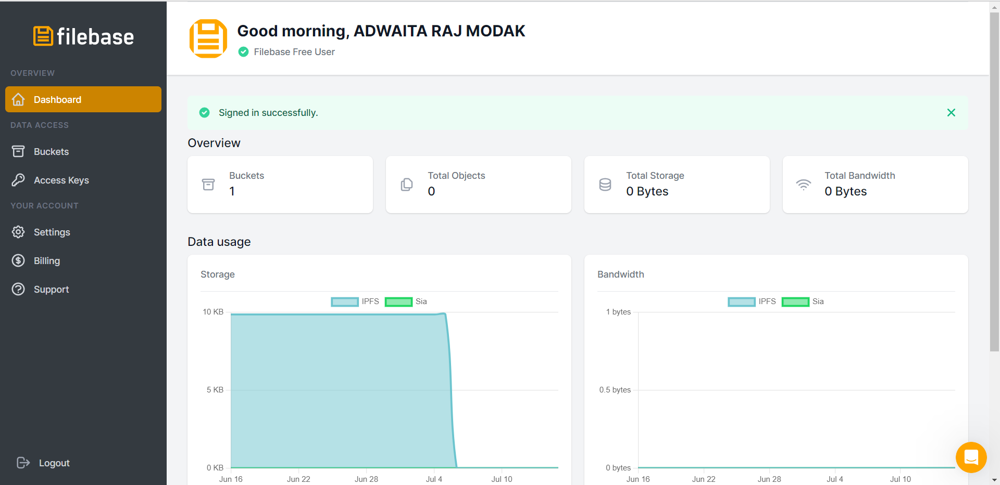

# DECENTRALIZED CHAT APPLICATION

## Description

A decentralized chat application made using GUNDB that is pinned to ipfs.

<!--- - What was your motivation?
 - Why did you build this project? (Note: the answer is not "Because it was a homework assignment.")
 - What problem does it solve?
 - What did you learn?
 --->
## Table of Contents (Optional)

- [Installation](#installation)
- [Usage](#usage)
- [Features](#features)


## Installation

- git clone https://github.com/RajAdwaita/decentralized-_chat_app
- cd decentralized-_chat_app
- npm run start

## Usage

- The concept of decentralized databases was used.
- We made use of FileBase.


- Once we log in to FileBase, we create our own IPFS bucket (IPFS Storage Network)
- Download and Install S3FS-FUSE on your OS
- Set up an Access Key File for use with it
```
${HOME}/.pwd_filebase
echo ACCESS_KEY_ID:SECRET_ACCESS_KEY > ${HOME}/.pwd_filebase chmod 600 ${HOME}/.pwd_filebase
 ```
- Use the secret key and the access id to mount the bucket
```
s3fs mybucket /path/to/mountpoint -o passwd_file=${HOME}/.pwd_filebase -o url=https://s3.filebase.com
```
- Clone the provided repo
- Run the application
- Run it on 2 instances if using localhost, and enjoy the features of real-time chatting 


## Features


